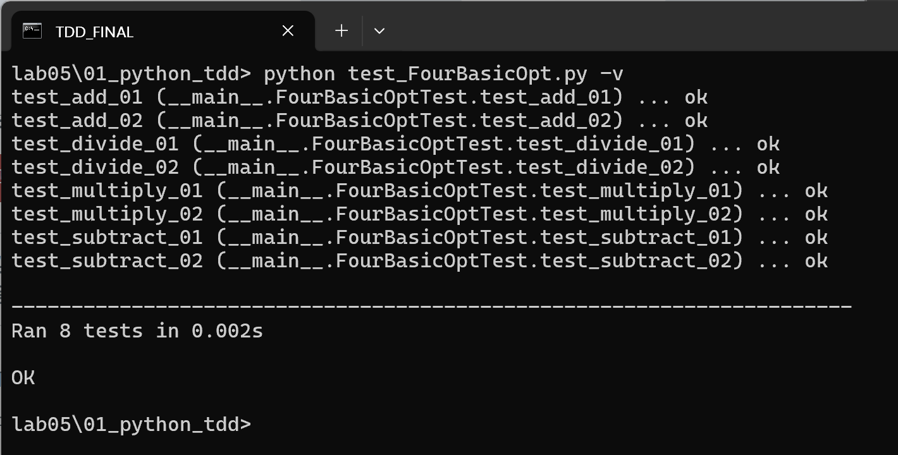
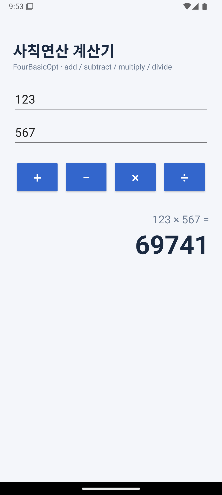
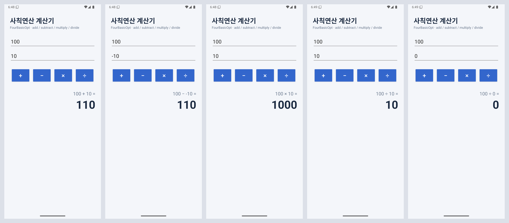

# lab05 — TDD 사칙연산 실습 & 사칙연산 안드로이드 앱

## 제출 내용

| 요구사항 | 위치 |
|---|---|
| 1. TDD 사칙연산 실습 — 최종 콘솔 텍스트 캡처 | [`images/01_python_tdd_console.png`](images/01_python_tdd_console.png) |
| 2. 사칙연산 안드로이드 앱 — 가상머신 실행 화면 캡처 | [`images/02_android_123x567.png`](images/02_android_123x567.png) |
| 소스 코드 전체 | [`01_python_tdd/`](01_python_tdd), [`02_android_calculator/`](02_android_calculator) |
| 실행 이미지 파일 | [`images/`](images) |

## 1. Test-Driven Development 실습: 사칙연산 (강의자료 ch04 48~52p)

| 파일 | 설명 |
|---|---|
| [`01_python_tdd/test_FourBasicOpt.py`](01_python_tdd/test_FourBasicOpt.py) | 테스트 코드 (unittest, 8개 케이스) — **먼저 작성** |
| [`01_python_tdd/FourBasicOpt.py`](01_python_tdd/FourBasicOpt.py) | 실제 코드 (`add`, `subtract`, `divide`, `multiply`) |

### TDD 진행 과정

1. **Red** — 테스트 코드만 작성한 뒤 실행 → `FourBasicOpt` 모듈이 없어 실패
   ([`images/console_step1_red.txt`](images/console_step1_red.txt))
2. **Red** — 강의자료 52p의 실제 코드(`return x / y`)를 그대로 작성 → 7개 통과, `test_divide_02`(100 ÷ 0 → 0 기대)가 `ZeroDivisionError`로 실패
   ([`images/console_step2_fail.txt`](images/console_step2_fail.txt))
3. **Green** — `divide`에서 `y == 0`이면 `0`을 반환하도록 수정 → **8개 테스트 모두 통과**
   ([`images/console_final.txt`](images/console_final.txt))

```bash
cd 01_python_tdd
python test_FourBasicOpt.py -v
```

### 최종 콘솔 캡처



## 2. 사칙연산을 수행하는 안드로이드 앱

[`02_android_calculator`](02_android_calculator) — Java, minSdk 24 / targetSdk 35, AGP 8.7.3, Gradle 8.10.2

- 두 숫자를 입력하고 `+ − × ÷` 버튼을 누르면 결과를 표시
- 계산 로직은 실습 1의 `FourBasicOpt`를 Java로 옮긴 클래스
  ([`FourBasicOpt.java`](02_android_calculator/app/src/main/java/com/example/fourbasicopt/FourBasicOpt.java)),
  0으로 나누면 0 반환
- 같은 8개 테스트 케이스를 JUnit으로 작성
  ([`FourBasicOptTest.java`](02_android_calculator/app/src/test/java/com/example/fourbasicopt/FourBasicOptTest.java))

```bash
cd 02_android_calculator
./gradlew testDebugUnitTest assembleDebug
```

### 실행 화면 (Android 에뮬레이터)

Pixel 6 에뮬레이터(Android 15, API 35)에서 `123 × 567` 실행 → **69741**



#### 추가 실행 화면

왼쪽부터 `100 + 10`, `100 − (−10)`, `100 × 10`, `100 ÷ 10`, `100 ÷ 0`



- 가로 모드에서는 입력·버튼을 왼쪽, 결과를 오른쪽에 배치한 별도 레이아웃(`res/layout-land`)을 사용해 한 화면에 모두 보이도록 함
- 긴 소수 결과는 유효숫자 10자리로 반올림해 표시
